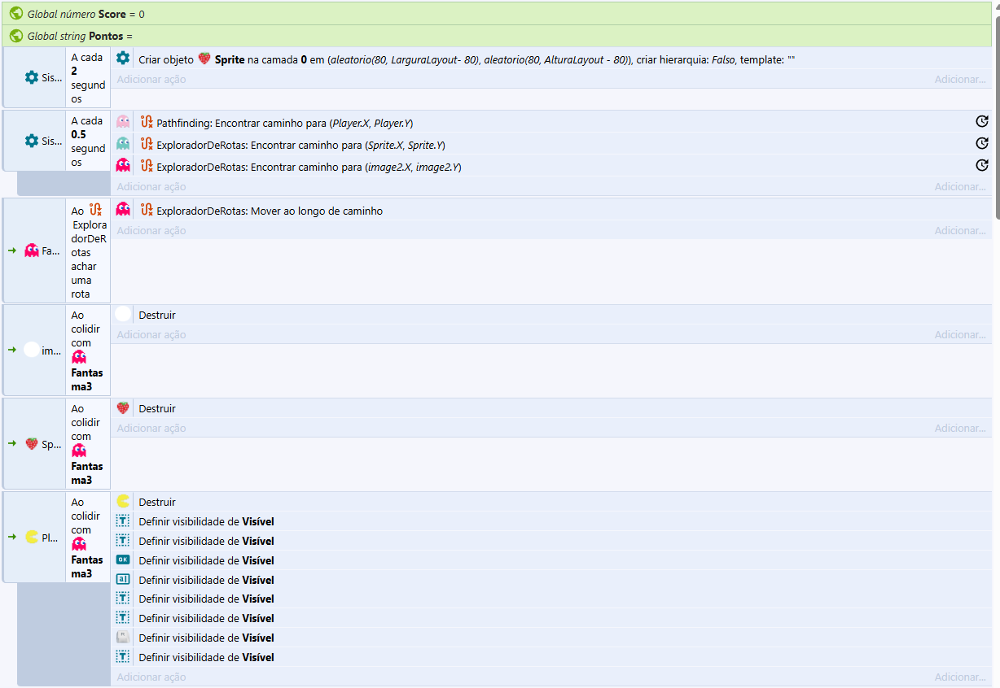
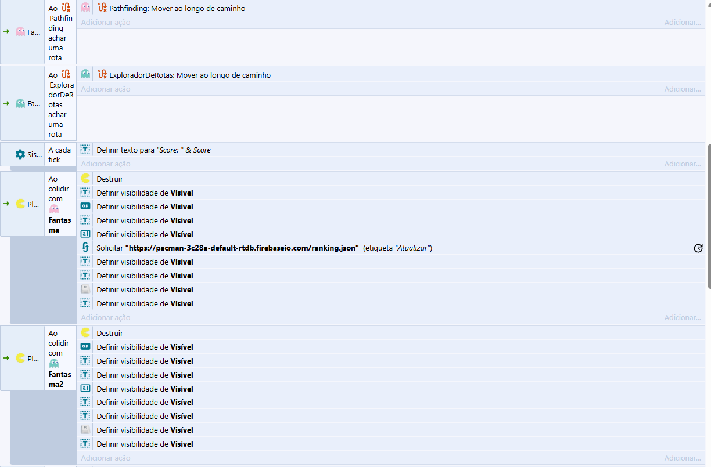
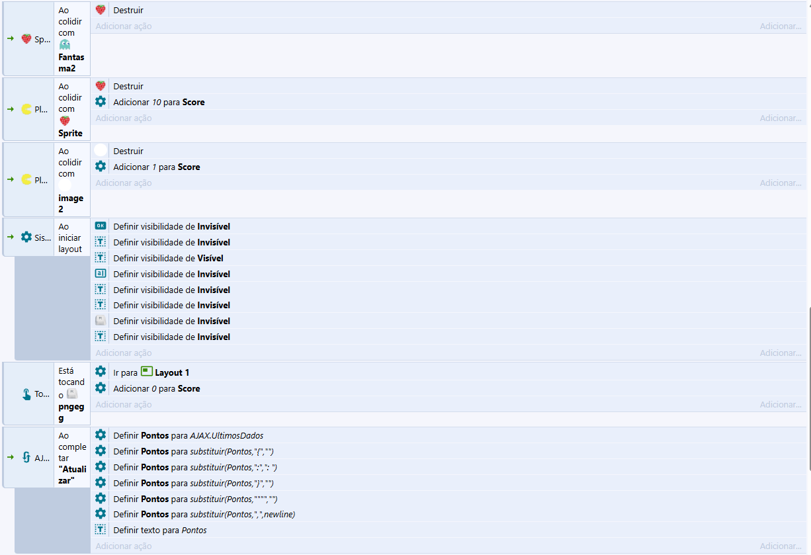
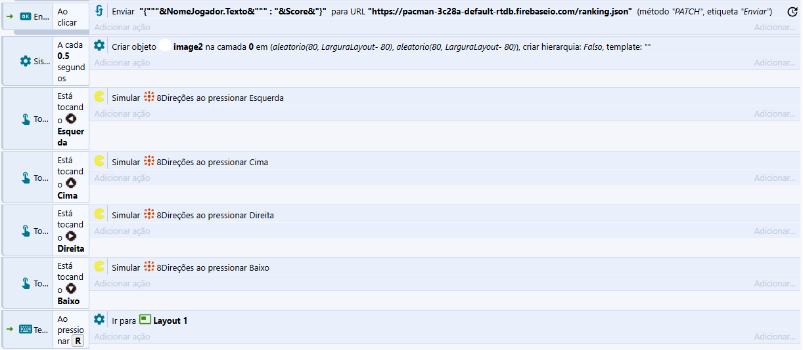

# GameFacefPacman
Nome: Felipe Nascimento de Morais
PacPoints é um projeto de jogo em que o personagem principal, inspirado no Pac-Man, tem como objetivo coletar "frutinhas" para alcançar a maior pontuação possível enquanto evita ser capturado por fantasmas inimigos.

A pontuação funciona da seguinte forma:

Frutinhas comuns: +1 ponto

Morangos: +10 pontos

O jogo apresenta três tipos de fantasmas, cada um com comportamentos distintos:

Fantasma Azul: Persegue exclusivamente os morangos, destruindo-os ao entrar em contato, o que impede o jogador de somar mais pontos. Caso alcance o jogador, este é eliminado.

Fantasma Rosa: Persegue diretamente o jogador. O contato resulta na eliminação imediata do personagem.

Fantasma Vermelho: Localiza e destrói as frutinhas comuns ao tocá-las. Também elimina o jogador em caso de contato.

O link do acesso ao jogo diretamente na Itch.io:
https://newnasci.itch.io/pacpoints

Print do Firabase (Banco de dados):
.png)

Prints das aplicações diretas do construct 3:

Link do Realtime Database (Ranking dos jogadores):
https://pacman-3c28a-default-rtdb.firebaseio.com/ranking.json